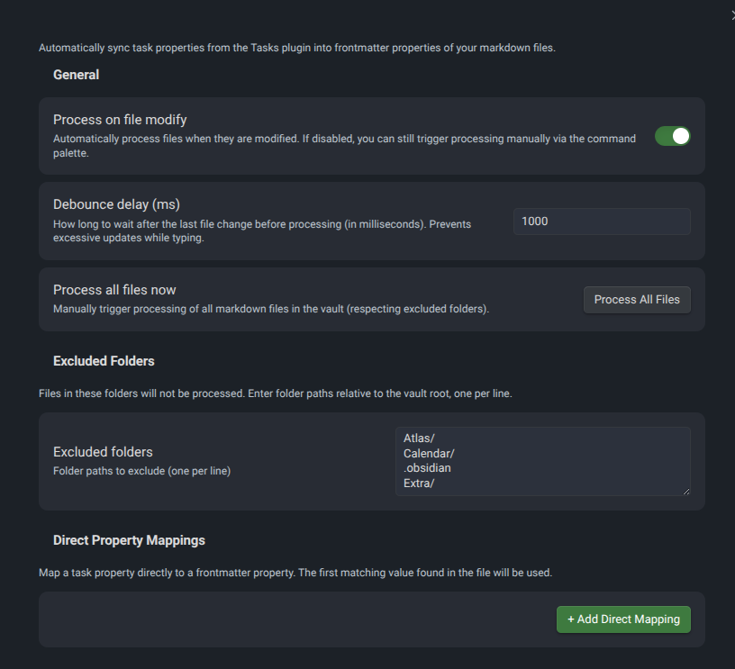
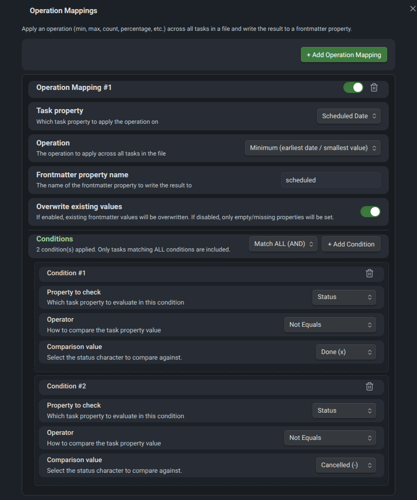

# TaskPropertyPlugin

Sync task properties from the [Tasks](https://github.com/obsidian-tasks-group/obsidian-tasks) plugin into frontmatter fields with configurable operations and conditions.

## Why this plugin?

The Obsidian Tasks plugin stores task metadata (due dates, scheduled dates, priority, status, etc.) inline using emoji markers. This works great for managing tasks, but it means that **frontmatter properties** — which Obsidian uses for sorting, filtering, and displaying metadata — don't automatically reflect your task data.

**TaskPropertyPlugin bridges this gap.** It reads the Tasks plugin metadata from your notes and writes computed values into frontmatter properties — automatically, in real-time.

### Perfect for Obsidian Bases

This plugin is especially powerful when combined with **Obsidian Bases** (database views). Since Bases reads frontmatter properties to build tables, filters, and views, TaskPropertyPlugin lets you effectively **combine the Tasks plugin with Bases**:

- Create a Bases table showing all project notes with their earliest scheduled date, progress percentage, or task counts — all pulled automatically from your tasks.
- Sort and filter project notes by due dates, completion status, or any other task property.
- Build dashboards that always stay in sync with your actual task data.

Without this plugin, you would need to manually update frontmatter every time you change a task. TaskPropertyPlugin does this for you.

## Features

- **Direct Property Mappings** — Map any task property (due date, scheduled date, priority, status, etc.) directly to a frontmatter field.
- **Operation Mappings** — Apply aggregate operations across all tasks in a file:
  - `min` / `max` — Earliest or latest date
  - `count` / `count_all` / `count_done` / `count_open` — Count tasks
  - `percentage_done` — Completion progress as a percentage
  - `list` — All values as a comma-separated list
  - `first` / `last` — First or last occurrence
- **Conditions** — Filter which tasks are included in an operation (e.g., "only open tasks", "only high priority tasks").
- **Condition Logic** — Combine multiple conditions with AND (all must match) or OR (any must match).
- **Excluded Folders** — Skip specific folders from processing (e.g., templates, archives).
- **Overwrite Control** — Per-mapping option to overwrite existing frontmatter values or only fill empty fields.
- **Automatic Processing** — Updates frontmatter on file modify with configurable debounce delay.
- **Manual Processing** — Trigger processing via the command palette for a single file or all files at once.

## Requirements

- **Obsidian** v1.4.0 or later
- **[Tasks Plugin](https://github.com/obsidian-tasks-group/obsidian-tasks)** — This plugin reads the emoji-based task metadata that the Tasks plugin creates. Tasks must use the standard emoji format:
  - `📅 2025-03-15` — Due date
  - `⏳ 2025-03-10` — Scheduled date
  - `🛫 2025-03-01` — Start date
  - `➕ 2025-02-20` — Created date
  - `✅ 2025-03-14` — Done date
  - `🔁 every week` — Recurrence
  - `⏫` / `🔼` / `🔽` / `⏬` / `🔺` — Priority (high, medium, low, lowest, highest)

## Installation

### From Obsidian Community Plugins (recommended)

1. Open **Settings** > **Community Plugins** > **Browse**
2. Search for **TaskPropertyPlugin**
3. Click **Install**, then **Enable**

### Manual Installation

1. Download `main.js`, `manifest.json`, and `styles.css` from the [latest release](https://github.com/CeeFeS/task-property-plugin/releases/latest).
2. Create a folder `task-property-plugin` inside your vault's `.obsidian/plugins/` directory.
3. Copy the downloaded files into that folder.
4. Restart Obsidian and enable the plugin under **Settings** > **Community Plugins**.

## Settings

### General Settings



- **Process on file modify** — Automatically update frontmatter when a file is saved. Disable this if you prefer manual processing only.
- **Debounce delay** — How long to wait (in ms) after the last edit before processing. Prevents excessive updates while typing.
- **Process all files** — One-click button to re-process every markdown file in the vault.
- **Excluded folders** — List of folder paths (one per line) to skip. Useful for templates, archives, or any folder where you don't want frontmatter auto-updated.

### Direct Property Mappings

Map a single task property to a frontmatter field. The first matching value found in the file is used.

### Operation Mappings with Conditions



Apply an aggregate operation across tasks in a file and write the result to a frontmatter property. Optionally filter tasks with conditions before applying the operation.

## Example Workflows

### Workflow 1: Track the next scheduled date (excluding completed tasks)

**Goal:** For each project note, write the earliest upcoming scheduled date into the `scheduled` frontmatter property — but only consider tasks that are not yet done or cancelled.

**Configuration:**
- **Task property:** Scheduled Date
- **Operation:** Minimum (earliest date)
- **Frontmatter property name:** `scheduled`
- **Overwrite existing values:** On
- **Condition 1:** Status — Not Equals — `x` (Done)
- **Condition 2:** Status — Not Equals — `-` (Cancelled)
- **Condition Logic:** Match ALL (AND)

**Result:** If your note contains:

```markdown
- [ ] Draft proposal ⏳ 2025-04-10
- [x] Research topic ⏳ 2025-03-28 ✅ 2025-03-28
- [ ] Review feedback ⏳ 2025-04-15
- [-] Old brainstorm ⏳ 2025-03-01
```

The frontmatter will be updated to:

```yaml
---
scheduled: 2025-04-10
---
```

The completed task (2025-03-28) and the cancelled task (2025-03-01) are excluded. The earliest remaining date is 2025-04-10.

### Workflow 2: Project progress percentage

**Goal:** Calculate the percentage of completed tasks and write it to a `progress` frontmatter property.

**Configuration:**
- **Task property:** Status (any — this is ignored for percentage_done)
- **Operation:** Percentage Done (%)
- **Frontmatter property name:** `progress`
- **Overwrite existing values:** On
- **Conditions:** None (all tasks are considered)

**Result:** If your note contains:

```markdown
- [x] Set up repository
- [x] Implement core logic
- [ ] Write documentation
- [ ] Add tests
- [x] Create CI pipeline
```

The frontmatter will be updated to:

```yaml
---
progress: 60
---
```

3 out of 5 tasks are done = 60%.

### Workflow 3: Earliest due date for a Bases dashboard

**Goal:** Surface the most urgent due date across all tasks in a note so that a Bases table can sort project notes by urgency.

**Configuration:**
- **Task property:** Due Date
- **Operation:** Minimum (earliest date)
- **Frontmatter property name:** `next_due`
- **Overwrite existing values:** On
- **Condition:** Status — Not Equals — `x` (Done)

**Result:** In your Bases table, you can now add a `next_due` column and sort ascending to see which projects need attention first.

### Workflow 4: Count open tasks

**Goal:** Show how many tasks are still open in a frontmatter field for quick overview in Bases.

**Configuration:**
- **Task property:** Status (any)
- **Operation:** Count Open Tasks
- **Frontmatter property name:** `open_tasks`
- **Overwrite existing values:** On

**Result:** A note with 8 tasks (3 done, 5 open) will get:

```yaml
---
open_tasks: 5
---
```

### Combining multiple operation mappings

You can add as many operation mappings as you like. A typical project setup might include:

| Operation | Frontmatter Property | Purpose |
|---|---|---|
| Min Scheduled Date (open only) | `scheduled` | Next upcoming work date |
| Min Due Date (open only) | `next_due` | Most urgent deadline |
| Percentage Done | `progress` | Overall completion |
| Count Open Tasks | `open_tasks` | Remaining work items |
| Count All Tasks | `total_tasks` | Total scope |

Combined with Bases, this gives you a fully automated project dashboard without ever touching frontmatter manually.

## Commands

Open the command palette (`Ctrl/Cmd + P`) and search for:

- **TaskPropertyPlugin: Process current file** — Process only the active file.
- **TaskPropertyPlugin: Process all files** — Process all markdown files in the vault (respecting excluded folders).

## Supported Task Properties

| Property | Tasks Plugin Emoji | Example |
|---|---|---|
| Due Date | `📅` | `📅 2025-04-15` |
| Scheduled Date | `⏳` | `⏳ 2025-04-10` |
| Start Date | `🛫` | `🛫 2025-04-01` |
| Created Date | `➕` | `➕ 2025-03-20` |
| Done Date | `✅` | `✅ 2025-04-14` |
| Recurrence | `🔁` | `🔁 every week` |
| Priority | `⏫🔼🔽⏬🔺` | `⏫` (high) |
| Status | Checkbox character | `[x]`, `[ ]`, `[/]`, `[-]` |
| Description | Task text | The task content without metadata |

## Condition Operators

| Operator | Description | Use Case |
|---|---|---|
| Equals | Exact match | Status equals `x` |
| Not Equals | Does not match | Status not equals `x` (exclude done) |
| Contains | String includes value | Description contains "review" |
| Not Contains | String excludes value | Description not contains "optional" |
| Is Empty | Property is not set | Due Date is empty |
| Is Not Empty | Property is set | Scheduled Date is not empty |
| Greater Than | After (dates) / larger | Due Date after `2025-04-01` |
| Less Than | Before (dates) / smaller | Due Date before `2025-05-01` |
| Greater or Equal | On or after | Start Date >= `2025-04-01` |
| Less or Equal | On or before | Due Date <= `2025-04-30` |

## License

This plugin is released under the [MIT License](LICENSE).

## Contributing

Contributions are welcome! Feel free to open issues or submit pull requests on [GitHub](https://github.com/CeeFeS/task-property-plugin).
